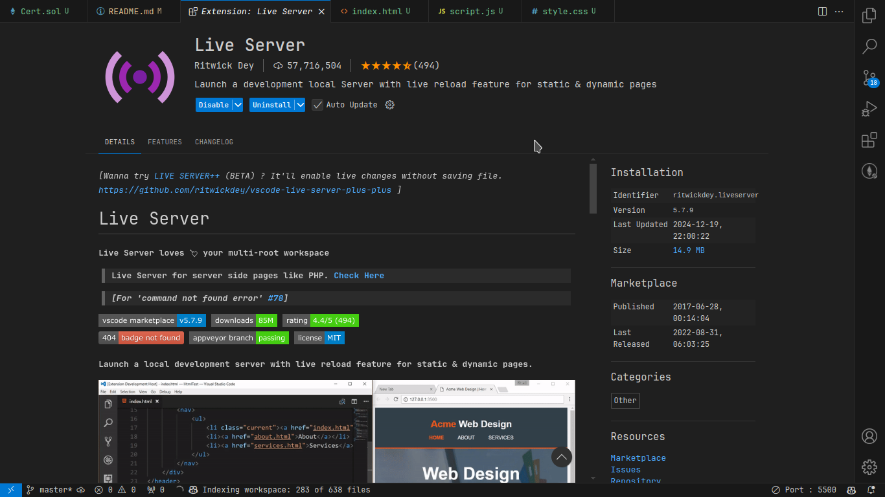
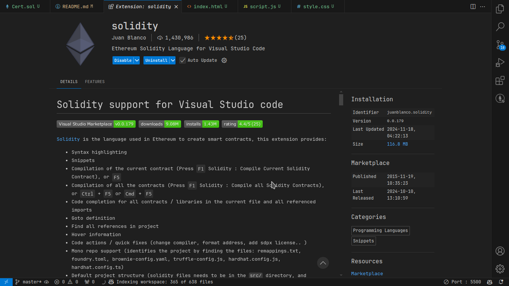

Inside Visual Studio Code install the following extensions:

- 
---
   
- 

- Install [metamask](https://metamask.io/download/) in your browser.
- After successfully installing metamask, reach out to me to send you some testnet tokens(fake cryptocurrency in other words) for you to try out things.

- Navigate to `webapp/index.html` and click "Go Live" on the bottom right corner.
- Connect your wallet and choose what certificates you want to upload to the blockchain from the `certs` folder
- You can create more certificates as you like from [here](https://craftmypdf.com/tools/free-online-certificate-maker/) but make sure that the certificates you create follow the same format as the ones in the `certs` folder as anything that deviates from the accompanying certificates will not work.